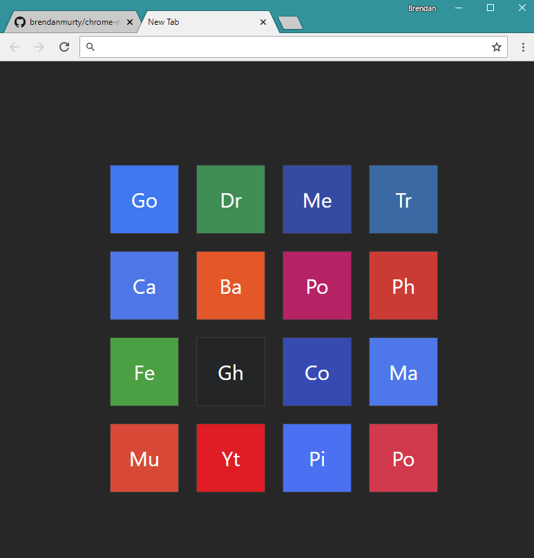

## Custom New Tab for Chrome

A simple extension for Chrome to replace the New Tab page.

Loads website tiles stored in a public online JSON file so that settings can sync between machines.

### Setup

1. Create a new copy of `example-sites.json` and add your own sites
2. Upload this file to your own web server and note the URL
3. Clone the repository
4. Update the URL to the JSON file by editing the `sites_json_file` variable in `script.js`
5. Add the same URL to the `permissions` section in `manifest.json`
5. Load the folder as an Unpacked Extension in Chrome by visiting `chrome://extensions`
